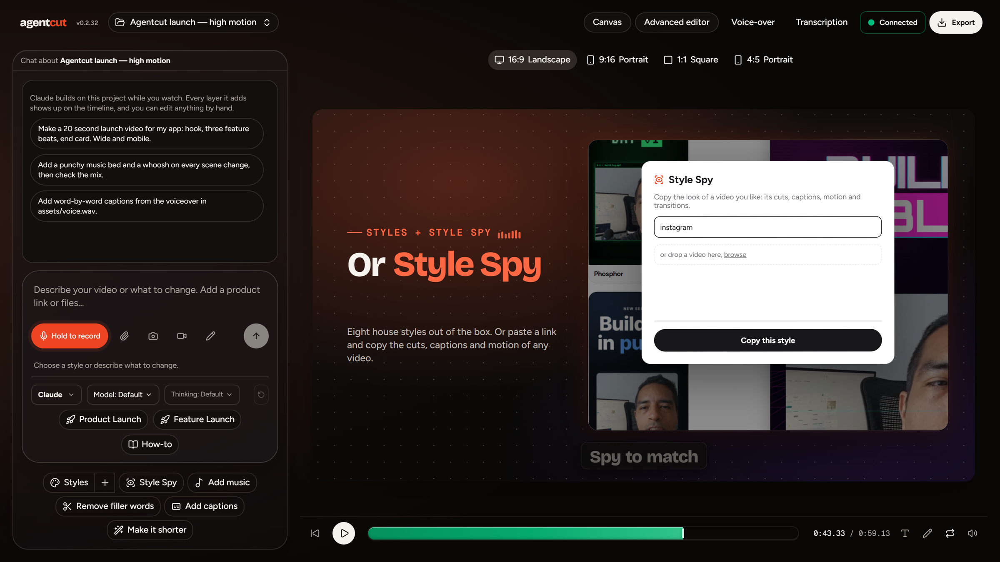
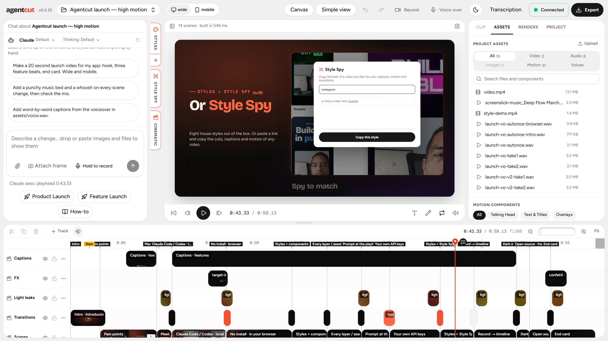

# Agentcut

**Edit video with a prompt.** Agentcut is an open-source video studio: you chat, and
Claude Code or Codex builds the video on your computer as real [Remotion](https://www.remotion.dev) code.
You watch the live preview, scrub the timeline, tweak any layer by hand, and export an MP4 from the browser.



**Try it:** https://agentcut.synteq.app · [components](https://agentcut.synteq.app/components) · [templates](https://agentcut.synteq.app/templates) · [loops](https://agentcut.synteq.app/loops) · [b-roll](https://agentcut.synteq.app/b-roll) · [sound effects](https://agentcut.synteq.app/sound-effects) · [changelog](CHANGELOG.md)

- **Chat to edit**: describe the change; the agent writes the scenes, layers, captions and sound. Type it
  or hold to speak, attach files or the current frame, or draw on the video to point at something.
- **Simple view or the full editor**: start with a chat and a preview, then switch to the Advanced editor
  (timeline, inspector, assets) at any time without losing your draft.
- **Style Spy**: paste an Instagram, TikTok, YouTube or X link (or drop a video) and copy its editing style,
  or clone a video you have the right to use as an editable project.
- **Launch videos and how-tos**: one click starts a Product Launch, Feature Launch or How-to video.
- **Cinematic Mode**: turn screenshots and screen recordings into camera moves around 3D devices.
- **Edit on the preview**: click to select, drag to move, pull a corner to resize, double-click to retype.
- **Record**: record talking-head takes from your camera in the studio, or send a video from your phone.
- **Sound and media**: free local voice-over, a sound effects library, a music library, archival and
  AI-generated b-roll, and downloads from links to any site.
- **Grade colour**: correct shots, match footage, apply looks and LUTs, and check colour scopes.
- **Scrub faster**: fast preview copies, cached frames and background pictures for slow scenes.
- **Reuse your style**: save editing rules from a project and apply them to new footage.
- **Export**: MP4 in the browser or rendered on your computer, up to 4K, in several formats at once.
- **Share**: send a whole project as an encrypted link that expires after 3 days.

## Simple view and the Advanced editor

The studio opens in **Simple view**: the chat on the left, the video in the centre, and quick actions
such as **Styles**, **Style Spy**, **Add music**, **Remove filler words**, **Add captions** and
**Make it shorter**. Pick a format (16:9, 9:16, 1:1 or 4:5) above the preview. On an empty project,
upload footage, record yourself, or describe a new video with text, voice, files or a product link.
Choose the agent (Claude Code or Codex), model and thinking level under the message box.

Select **Advanced editor** for the full studio: a multitrack timeline, the clip inspector, assets,
renders and project settings, plus the Styles, Style Spy and Cinematic tabs. **Simple view** switches back.
The project, draft, attachments and selected options stay the same in both views.



**Canvas** shows the project's videos as cards: source recordings connect to the clips and versions made
from them, and each card can be played, edited, chatted about or exported on its own. New launch or
how-to requests on an existing edit become a separate video in the same canvas.

Other ways to direct the agent:

- **Speak instead of typing.** Hold the mic button, or hold Ctrl+Space, in any prompt box. Speech is
  recognised in the browser (English, about 250 MB downloaded once); no audio leaves your computer.
- **Draw on the video.** Use the pencil under the preview to circle or point at something, then describe
  the change. You can also ask from the timeline playhead.
- **Edit on the preview.** Click text or a picture to select its clip, drag to move it, and pull a corner
  to resize it; it snaps to the frame's edges and centre. Double-click text to retype it, or use
  **Add text** to put a new text clip at the playhead.
- Chat shows token use for each request and a running total for the project.

## Style Spy

Paste an Instagram, TikTok, YouTube or X link, or drop a video file, then choose what to make:

- **Copy the style** keeps your footage and story and takes the reference's editing: layouts and split
  screens, cut rhythm, captions, motion graphics, transitions and colour. On an empty project it asks what
  your video is about first.
- **Clone the video** rebuilds a video you have the right to use as an editable project. Text, captions and
  graphics are redrawn at the measured size, position and frame; footage and people stay as clips of the
  original. Confirm that you have the rights before it starts.

The import measures every frame on your computer: hard cuts, flashes and transitions, shots that share a
setup, and things that appear inside a shot. The agent works from those measurements and a few images, so
it uses fewer tokens, and it can compare reference frames with its own edit side by side.

## Cinematic Mode and motion components

The **Cinematic** tab turns screenshots and screen recordings into short product shots: 3D iPhone and
MacBook models, camera pushes, pans and macro close-ups, lens blur and reflections. You can load your own
GLB device model from the workspace library.

Scenes can use the built-in motion component library (titles, captions, transitions, overlays, light
leaks and 44 seamless motion loops) and the templates. Browse them on the
[components](https://agentcut.synteq.app/components), [templates](https://agentcut.synteq.app/templates)
and [loops](https://agentcut.synteq.app/loops) pages. The Styles gallery has ready-made house styles for
talking-head videos, and you can save your own (see below).

## Sound and media

- **Voice-over** uses free local Kokoro by default, with 28 English voices. Optional local Ming voices run
  on CPU or NVIDIA GPUs. ElevenLabs, Gemini, OpenAI and xAI run only when you select one and add your key.
  Manage voices in the **Voices** tab of Assets. See [local voice setup and limits](docs/local-voice.md).
- **Transcription** uses local Whisper, or AssemblyAI with your key, for captions and filler-word removal.
- **Sound effects**: 276 effects ship with Agentcut, searchable by the agent and on the
  [sound effects](https://agentcut.synteq.app/sound-effects) page.
- **Music**: browse and audition the built-in library from the chat, bring your own file, or generate a
  track with Gemini Lyria using your key.
- **B-roll**: public-domain archival footage plus a separately labelled AI-generated collection, searchable
  by the agent and on the [b-roll](https://agentcut.synteq.app/b-roll) page.
- **Downloads**: give the agent a link to a song, video or image from any site and it saves the file to the
  project (up to 2 GB). Protected links need downloading yourself first.
- **Speaker framing**: ask the agent to keep a speaker centred; it tracks the face locally and the crop
  follows them in the preview and the export.

## Export

Click **Export** to choose videos and formats. Each named video on the canvas can be exported separately,
in several formats in one batch, at project size, 720p, 1080p or 4K, with a high quality or maximum quality
setting. Render in the browser or on your computer; local renders capture lossless frames before encoding.
Finished videos appear under **Renders**, where you can also make a smaller copy without another edit.

## Video types in chat

Choose **Product Launch** to introduce a product, **Feature Launch** to show what a new feature lets people do, or **How-to** to teach a task. You can also type
the request. Add a brief, URL or files in chat, or drop footage and images into the project Library.
The actions keep your attachments, selected style and music and use the normal chat send path.

On an empty project, a bare request shows a short question in the studio without an agent call or
model-token use. Add the product description, feature, or task and press Send once. With existing project
material, the agent inspects it first. A project name or unrelated shared stock is not a brief.
The agent chooses duration and camera moves from your request and material; no slider is needed.

See [video workflow notes](docs/video-workflows.md) for the approved launch example, review checks
and the process for improving these guides. How-to uses the normal studio workflow; it is separate
from the limited release-announcement capture prototype below.

## Preview and timeline

Drag the timeline playhead or the playback slider to find a frame. The playhead follows the pointer
at once. The preview skips intermediate requests when it cannot draw them fast enough. On release,
it waits for the exact final frame before it resumes playback, if playback was active before the drag.

For local footage with sparse keyframes or a long edge above 1920 pixels, the helper can make a
fast-seeking preview copy in the background. It switches to a ready copy while paused. HDR video,
transparent video and clips shorter than two seconds keep their original files. Copies are stored in
the workspace's `.agentcut/proxies` cache, with a 10 GB limit and oldest entries removed first. Copies
unused for 14 days, or whose footage or project was deleted, are removed too.
Replacing a source file causes the studio to request a new copy.

Recent paused video frames are cached for repeat seeks. Scenes measured as slow can also get small
pictures rendered while the preview is idle. These pictures appear during a drag. Timeline thumbnails
use WebCodecs when supported, with a video-element fallback, and use preview copies when available.
Captures and exports always read the original footage.

The agent can use `agentcut_preview_check` and `agentcut_status` to inspect seek times per clip,
as well as playback performance. These measurements help identify slow sections.

## Colour grading

In Advanced view, select a video or image clip and open **Color** in the inspector. Use
**Whole video color** in the project inspector for a common grade across footage.

- Adjust exposure, temperature, tint, contrast, highlights, shadows, whites, blacks and saturation.
  Use colour wheels, RGB curves, the eight-band mixer and skin protection for further control.
- Choose from 18 built-in looks, import a 3D `.cube` LUT, adjust its strength, or save a look as a `.cube`.
- Check a waveform, RGB parade, vectorscope or histogram. Hold the eye button to compare with the original.
- Match exposure and white balance between shots, copy a clip's grade, or build a look from a reference
  image or video. The matching tools report measurements before and after the change.
- Use adjustment layers to grade footage below them for part of the timeline. Add keyframes to change
  a grade over time. Add grain, halation, bloom or vignette as finishing effects.

A video receives its own grade, then adjustment layers above it, then the project grade. A video clip
can opt out of inherited grades. Images only inherit them when enabled; text, captions and scene
graphics keep their own colours. Colour effects use the same grade engine for preview and export.

The agent tools are `agentcut_color_check`, `agentcut_match_shots`, `agentcut_match_look`,
`agentcut_grade_subject` and `agentcut_color_looks`. See the
[colour guide](skills/agentcut/references/color.md) for the format and workflow.

## Person cutouts and saved editing styles

Ask the agent to put text or graphics behind a person. It processes the required frames on your
computer and puts the person on a separate layer. The first use downloads a model of about 26 MB.
You can also grade the person and background separately, for example to keep the person in colour
over a monochrome background. Review the edges and rerun the operation after changing framing or trims.

Use the plus action beside **Styles** to save reusable editing rules from a project. The agent reads
the project and available edit history. Apply the saved style to different footage from
**Saved editing styles**, or delete it with confirmation. Existing videos remain unchanged.
The b-roll library includes public-domain archive footage and a separate collection labelled as AI-generated.

The studio asks for confirmation before deleting clips or tracks, discarding a recording, clearing a
drawing, removing a queued message or removing a provider key. Timeline deletions can be undone.
If the helper rejects an invalid timeline or project setting, the editor restores the saved value.

## External agents and announcement drafts

External MCP clients can use the packaged guides, project file tools, media tools, colour checks,
preview checks and exports. Start with `agentcut_capabilities`, `agentcut_guide` and `agentcut_status`.
See the [helper README](packages/agentcut/README.md#external-mcp-agents) for connection details.

The local announcement prototype records a website through a separate browser profile and builds
an editable draft from observed actions and a shot plan. Jobs support progress, pause, resume and
cancellation. Review the draft before export. See the
[announcement workflow](packages/agentcut/README.md#local-release-announcement-prototype).

### Search and social sharing

Set `NEXT_PUBLIC_APP_URL` to the production origin **before building** when hosting on another domain.
It controls canonical links, Open Graph URLs, structured data, and the sitemap.
`/sitemap.xml` lists the public pages and all motion components. `/robots.txt` links to it.
The local `/studio` page has `noindex` and is excluded from the sitemap.

The 1200 × 630 share image is `public/og/agentcut.jpg`. Page titles, descriptions, and share
metadata use `lib/seo.ts`. After deployment, submit `/sitemap.xml` in Google Search Console
and check a shared link in the social platforms you use. Search indexing and cached social
previews are controlled by those services.

## How it works

```
 browser (agentcut.synteq.app)            your computer (npx agentcut)
 ┌──────────────────────────────┐         ┌───────────────────────────────────┐
 │ chat · preview · timeline    │◀──ws───▶│ helper on 127.0.0.1:32118          │
 │ inspector · browser export   │         │  ├ Claude Code / Codex (your login)│
 └──────────────────────────────┘         │  ├ workspace: ~/Agentcut/projects  │
                                          │  └ agentcut MCP tools for the agent│
                                          └───────────────────────────────────┘
```

The studio uses a local helper: your agent and API keys stay on your computer. The page connects to
the helper on `127.0.0.1`, the agent writes scenes and layers, and the page rebuilds the preview live.
Project files stay local unless you choose to share them with a link.

## Quick start

1. Install [Node.js LTS](https://nodejs.org/en/download) (20.10 or newer), then
   [Claude Code](https://claude.com/claude-code) or [Codex](https://developers.openai.com/codex/cli),
   and sign in once.
2. Start the helper:

   ```bash
   npx -y agentcut
   ```

3. Open https://agentcut.synteq.app/studio in Chrome and start chatting. When Chrome asks to let the page
   access devices on your local network, click **Allow**: that is how the page reaches the helper.

Helper options:

```bash
npx -y agentcut --dir D:\videos              # workspace folder (default ~/Agentcut)
npx -y agentcut --agent codex                # start the chat with Codex
npx -y agentcut --add-dir path/to/your-app   # let the agent read your app's code (remembered)
npx -y agentcut --no-bash                    # no shell commands for the agent
npx -y agentcut --allow-domain cdn.example.com  # let Claude Code's sandboxed shell reach another site (media links work without this)
```

Agents run without asking before each command, so they are sandboxed. Claude Code's shell writes only to the
workspace, reaches only npm and Openverse (media from other sites comes through the helper), and can't read logins
or keys (macOS, and Linux with `bubblewrap` and `socat`; **Windows has no sandbox, so use `--no-bash` with files you don't trust**). Codex's shell
writes only to the workspace, but it can read your files and reach any site unless you pass `--no-bash`.

Voice-over uses free local Kokoro by default (the first generation downloads about 93 MB). Paid
voice-over (ElevenLabs, Gemini, OpenAI, xAI) and music generation (Gemini Lyria) use your own keys,
entered in the studio and kept in your user folder.

Style Spy downloads references with [yt-dlp](https://github.com/yt-dlp/yt-dlp) and
[ffmpeg](https://ffmpeg.org): the helper fetches both on first use into `~/.agentcut/tools` (checksums
verified, nothing installed system-wide) and keeps yt-dlp up to date. Only public videos are downloaded,
unless you click **Retry with my browser login**, which uses that browser's login once for that video.
Record needs camera and microphone access in the browser.

## Share a project

When sharing is configured, click **Share** to create an encrypted project link. Anyone with the
complete link can import the project into their own Agentcut workspace. Links expire after 3 days
and support projects up to 1 GB. Renders and chat history are excluded.

The helper encrypts the files before upload. The key is in the link's `#` fragment and is not sent
to the share service. Keep the complete link private. Shared projects contain code; only open links
from people you trust.

Both users need helper 0.2.12 or newer. For self-hosting, deploy the
[share Worker](workers/share/README.md) and set `NEXT_PUBLIC_SHARE_API_URL` before building the site.
The Share button is hidden when this setting is empty.

## Send a video from your phone

Start the updated helper and open the desktop studio. Select **Phone → Connect a phone**, then scan
the QR code and select **Connect phone**. The private link expires after ten minutes and can connect
one phone. The phone remembers the connection in this browser.

On `/phone`, record or select a video, add optional edit instructions, and select **Send and edit**.
Enable automatic sending to start as soon as you accept a recording or select a file. Instructions
are saved on the phone. With no instructions, the agent makes a clean edit and preserves the format.

Keep the phone page open until the upload completes. Input files and results are limited to 1 GB each;
videos can be up to two hours long. The helper must be running and the computer must be awake, with
an installed, signed-in coding agent. Jobs wait while another agent or local render is running. If
the desktop studio is open, the helper uses it for the edit and then restores the previous project.
Otherwise it starts a separate background browser. The first job can take longer while browser and
render dependencies are installed. Agent and media-provider usage uses your existing local accounts.

The phone encrypts video parts and edit instructions before upload. The relay stores job status and
file sizes but does not receive the encryption key. The helper deletes the temporary input after
saving it locally. Results and uncollected uploads expire three days after the job was created.
Select **Open video** to open its private result page. Opening the page loads only video details.
Select **Watch video** to load and play it, or **Download** to save a copy. **Delete online video**
removes the online copy and disables its link; the project and rendered file on the computer stay.
The page shows the expiry time. Anyone with the complete private link can watch, download, or delete
that one result, so keep the link private. It cannot send new edit requests or open other results.
Playback decrypts the video into browser memory before it starts; large videos need enough available
memory. Watching does not save a file to your phone. The local render remains in `renders/`.

Remove the connection from the desktop Phone dialog or the phone page to revoke access. If the helper
stops during an edit, the job reports an error and is not edited twice automatically. Open the saved
project on the computer to continue. Clearing the phone browser's storage requires a new connection.

Self-hosting: deploy the updated [transfer Worker](workers/share/README.md), including the `PhoneInbox`
Durable Object migration. Set `NEXT_PUBLIC_PHONE_API_URL` at site build time, or use the existing
`NEXT_PUBLIC_SHARE_API_URL`. Configure `AGENTCUT_EDITOR_ORIGIN` on the helper for a self-hosted studio
and allow that origin with `--origin`. No router port forwarding is required.

## Versions

The studio shows its version next to the logo (hover for the helper's). The editor and the helper are
released together with the same version number; [CHANGELOG.md](CHANGELOG.md) lists what changed. When the
page needs a newer helper, the connection badge says **Update helper**: stop it and run
`npx -y agentcut@latest`.

## Develop

```bash
npm install
npm run helper:build   # build the helper (the agent's MCP server runs from packages/agentcut/dist)
npm run helper         # start the helper from source
npm run dev            # http://localhost:3000 (landing), /studio, /components, /templates
npm run test:share     # share Worker and helper regression tests; no Cloudflare account required
```

- Restyle: the theme is plain shadcn tokens in `app/globals.css` (`:root` / `.dark`). Components are in `components/ui`.
- Studio UI: `components/studio`, logic in `lib/studio`.
- Motion component library: `motion/components` (see its README). After changing it or `skills/agentcut`,
  run `npm run sync:skill` so the helper ships the new copy.

### Local render performance

Local renders use up to two workers by default, with fewer workers when free memory is low.
Media caches are bounded independently; these limits do not cap Chrome's total graphics memory.
To compare worker counts, set `AGENTCUT_RENDER_CONCURRENCY` before starting the helper. It must
be a positive integer no greater than the available CPU count; available memory can reduce it.
Use the same short frame range when comparing settings, since more workers can increase memory
pressure and make complex scenes slower. The helper log records settings, progress, and elapsed time.

Run `node --import tsx --test tests/render-policy.test.mjs` to check worker selection and progress parsing.

### Releasing

1. Add the changes under **Unreleased** in `CHANGELOG.md`, then move them to a new version heading.
2. Bump `version` in `package.json` (editor) and `packages/agentcut/package.json` (helper) to the same
   number and update `package-lock.json`. If the page now needs the new helper, raise
   `MIN_HELPER_VERSION` in `lib/version.ts`.
3. Run the build, type checks and tests. Use `npm pack --dry-run --workspace agentcut` to check the
   helper package; its prepack step syncs the skill and builds the helper.
4. Commit, create an annotated tag `vX.Y.Z`, and push the commit and tag.
5. Publish the helper manually from that release: `cd packages/agentcut` then `npm publish`.
   This syncs the skill and builds again. Pushing a Git tag does not publish to npm.
   Normally publish the helper before the site deploys when the page needs it. If npm publication
   is delayed, the deployed editor can show an update notice before the new helper is available.

## Deploy

The site is a Next.js app with no backend; the `Dockerfile` builds a standalone server that listens on
`$PORT`, with a `/healthz` route for health checks. On [Synteq Apps](https://cloud.synteq.com/apps), link
this repo (root directory `/`); pushes to `main` build the Dockerfile and roll out. Optional build-time
env: `NEXT_PUBLIC_APP_URL`, `NEXT_PUBLIC_MUSIC_CDN_URL`, `NEXT_PUBLIC_BROLL_CDN_URL`,
`NEXT_PUBLIC_SHARE_API_URL` (see `.env.example`). The b-roll
catalog is built and uploaded with `scripts/broll-index` (see its README).

```bash
docker build -t agentcut-web . && docker run -p 3000:3000 agentcut-web
```

If you host the page on another origin, start the helper with `--origin https://your-host` (or set
`AGENTCUT_ORIGINS`) so it accepts that page.

## License

MIT.
